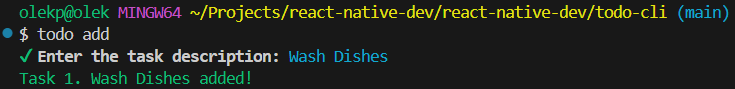
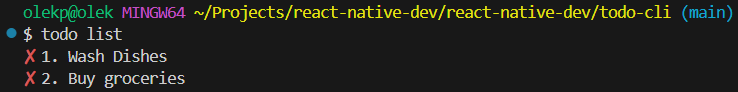

# To-Do CLI

A command-line to-do list app built with Node.js, Commander, Inquirer, and Chalk.


## Features
- Add tasks with user input.
- Remove tasks by ID.
- List all tasks.
- Mark tasks as done.
- Persist tasks in `tasks.json`.

## Setup
1. Clone the repository:
   ```bash
   git clone git@github.com:olek-scau/react-native-dev.git
   ```

2. Navigate to the project:
   ```bash
   cd todo-cli
   ```

3. Install dependencies:
   ```bash
   npm install
   ```

4. Link the CLI:
   ```bash
   npm link
   ```

5. Run the app:
   ```bash
   node index.js

## Usage

- Add a task:
   ```bash
   node index.js add
   ```
   or
   ```bash
   todo add
   ```

- List all tasks:
   ```bash
   todo list
   ```

- Mark a task as done:
   ```bash
   todo done <id>
   ```

- Remove a task:
   ```bash
   todo remove <id>
   ```

- Show help:
   ```bash
   todo --help
   ```

## Testing

The project uses Jest with ESM support for unit testing. Run tests with:
   ```bash
   npm test
   ```
   
## Screenshots

